# Vi 활용법 2시간에 따라잡기

vi의 기본적인 활용법을 예제를 이용하여 이해를 돕기 위한 자료이다.

  * [환경 설치 및 실행](#환경-설치-및-실행)
    + [다운로드](#다운로드)
    + [기본환경](#기본환경)
    + [실행](#실행)
  * [파일](#파일)
    + [파일 열기](#파일-열기)
    + [저장](#저장)
  * [편집](#편집)
    + [삽입](#삽입)
    + [삭제](#삭제)
    + [복사 및 붙여넣기](#복사-및-붙여넣기)
    + [검색](#검색)
    

## 환경 설치 및 실행

vi 에디터는 텍스트 편집기의 일종으로 프로그램 설치를 요구한다. 자세한 사항은 vi 홈페이지를 참고한다.

### 다운로드

윈도 환경에서는 설치파일을 받아서 직접 실행하여 프로그램을 설치할 수 있다. 리눅스에서는 apt-get 등의 패키지 관리 명령어를 이용하여 자동설치가 가능하다. 

### 기본환경

vi 에디터의 기본 설정은 \_vimrc (윈도우) 또는 .vimrc (리눅스) 파일에 정의된다. 저자가 사용하는 기본적인 환경 파일 [vimrc](./vimrc/_vimrc)을 C:\Program Files\vim\ 밑에 복사한다. 리눅스의 경우 .vimrc파일을 홈 디렉토리에 저장한다. 

### 실행

윈도에서는 파일을 오른쪽 클릭 후 Edit with Vim을 선택하면 된다. 리눅스에서는 vi 명령어를 직접 사용하여 파일을 지정하면 된다. 지정된 파일명이 폴더에 존재하지 않는다면 새 파일이 생성되고, 기존에 있는 파일을 지정할 경우 그 파일을 편집가능한 모드로 열게 된다.

``` shell
% vi foo.c
```

리눅스의 명령어 터미널 환경에서는 다음과 같은 형태로 입력하게 된다.

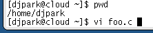

## 파일

이제 vi 에디터를 이용하여 본격적으로 파일을 생성하고 저장해보자. 앞서 설명한 것 처럼 vi 명령어를 이용하여 파일을 생성, 편집할 수 있다.

### 파일 열기 

 다음 명령어를 살펴보자. foo.c 파일이 존재하면 그 파일을 편집가능한 모드로 읽는다. 만약 foo.c가 존재하지 않았다면 새로운 파일을 생성하게 된다.

``` shell
% vi foo.c
```

편집기 안에서 vi 명령어  :e를 이용하여 직접 파일을 편집 모드로 열수 있다. 혹시 입력모드에 있을 수 있으며로 반드시 esc를 한번 누르고 난 뒤 :e를 입력하여 뒤에 열고자 하는 파일을 지정해야 한다.

vi 내부에서 명령어를 입력하는 모습은 다음과 같다.

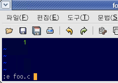

### 저장

편집이 끝났다면 파일로 저장해야 한다. 이때는 vi 내부 명령어 :w를 사용한다. 마지막으로 프로그램을 종료하고 나가기 위해서 :q 를 입력한다.

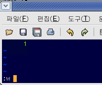

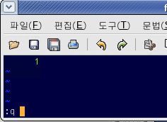

## 편집

이제 파일에 텍스트를 삽입하거나 수정, 삭제 등의 편집 작업을 해보자.

### 삽입

vi 명령어를 이용하여 파일을 열고난 뒤 명령어 i를 누르면 이때부터 키보드로 입력하는 모든 내용은 텍스트에 삽입된다. 

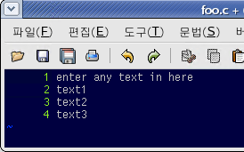

다시 명령어 입력모드로 전환하기 위해서는 esc를 누르면 된다. 명령어 모드로 나오기 전에 입력한 모든 텍스트 (명령어)는 파일에 직접 입력되어 화면상에 표시되니 주의한다. 따라서 텍스트 입력후 esc를 습관적으로 누르거나 명령어 입력전에는 반드시 esc를 한번 입력하는 습관을 들이면 된다.

### 삭제

명령어 i를 입력하여 현재 편집 가능한 상태로 바뀌었다면 텍스틀 입력하고 삭제하고 싶을 때 백스페이스 키를 눌러서 제거할 수 있다. vi 프로그램 버젼에 따라 백스페이스가 지원되지 않을 경우 vi 명령어로 텍스트를 삭제할 수 있다. 이를 위해서 esc키를 눌러서 명령어 입력모드로 전환한 후 커서를 이용하여 삭제 하고자 하는 텍스트로 이동한 뒤 x를 입력하면 해당 커서의 문자가 하나씩 삭제되는 것을 볼 수 있다.

한줄 전체를 삭제하고 싶을 때는 vi 명령어 모드에서 dd를 입력하면 된다. 삭제와 동시에 한줄 전체가 뒤에 다른곳에 복사할 수 있도록 버퍼에 저장된다.

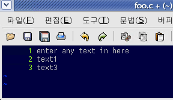

### 복사 및 붙여넣기

현재 복사 버퍼에 어떤 문자열 저장되어 있다면 vi 명령어 모드에서 p를 입력하면 해당 커서를 기준으로 붙여넣기가 수행된다. 앞에서 dd를 이용하여 한개 라인 전체를 삭제했다면 그 라인 전체가 복사 버퍼에 있으므로 원하는 위치에서 p를 입력할 경우 한줄 전체가 붙여넣어진다. 

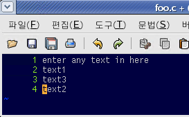

만약 한줄을 삭제하지 않고 복사만 하고 싶은 경우 vi 명령어 모드에서 yy를 입력해본다. 

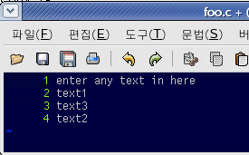

이때 현재 커서 위치의 한줄 전체가 복사 버퍼에 저장되지만 화면에는 특별한 메세지가 뜨지 않음에 주의하자. 커서를 원하는 위치로 이동하여 똑같이 명령어 p를 입력하면 앞에서 복사한 한줄 전체가 붙여넣기가 성공적으로 수행되는 것을 볼 수 있다. 

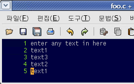

### 검색

현재 열려 있는 파일 내부에 특정 텍스트를 검색하고 싶다면 vi 명령어 모드에서 슬래쉬 (/) 다음에 검색어를 쓰고 엔터를 누른다. 

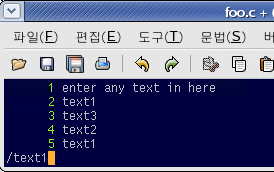

매칭이 되는 위치로 커서가 이동하며 n을 반복적으로 누르면 다음 검색을 반복하게 된다. 

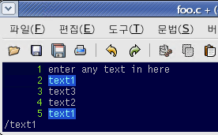


